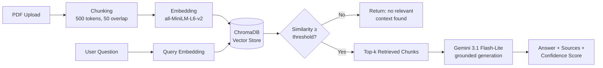
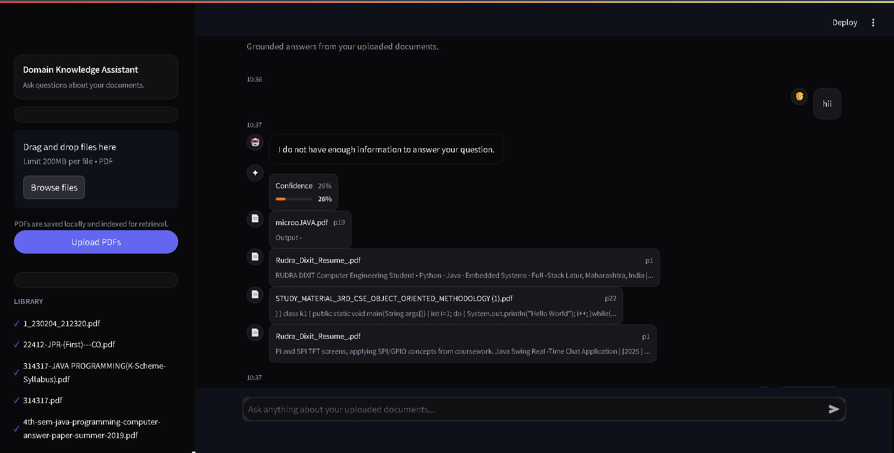
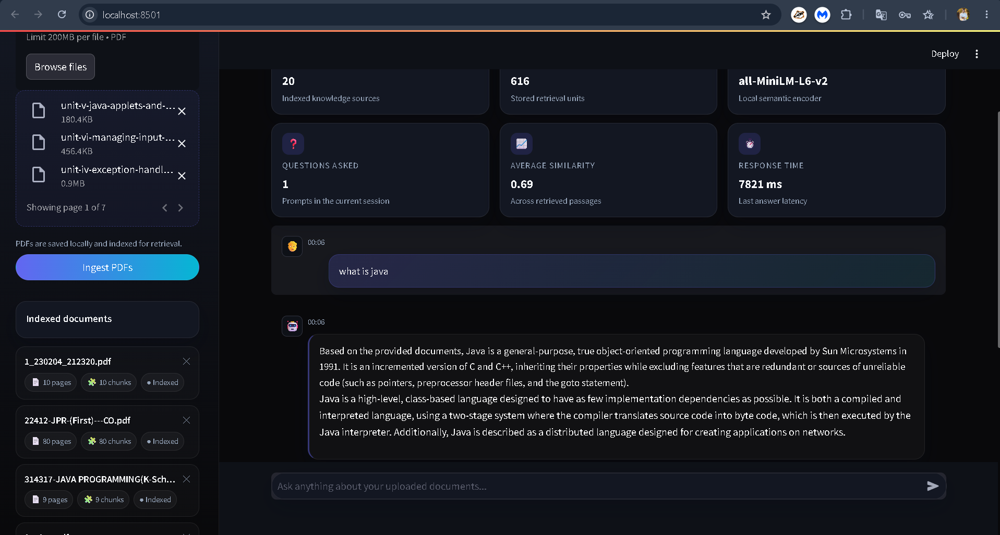

# 🧠 Domain Knowledge Assistant — RAG Chatbot

A Retrieval-Augmented Generation (RAG) chatbot that answers questions strictly from your own PDF documents, with source citations and a visible confidence score for every answer.

Built to solve a real problem with LLM chatbots: **hallucination**. This system only answers when it can find relevant supporting text in your documents — and tells you honestly when it can't.

---

## Why this project

Most "chat with your PDF" demos skip the hard part: knowing when *not* to answer. This project treats grounding as a first-class feature, not an afterthought — every response ships with a visible confidence score, and the system explicitly declines to answer rather than guess when retrieval quality is too low.

## Features

- 📄 **Multi-PDF ingestion** — upload and index multiple documents into a persistent local vector store
- 🔍 **Semantic retrieval** — sentence-transformer embeddings + ChromaDB similarity search
- 🤖 **Grounded generation** — Gemini answers using only retrieved context, with an explicit instruction not to fabricate
- 📊 **Grounding confidence meter** — every answer shows a visual, color-coded confidence score (green/amber/red) based on the actual top similarity score
- 📎 **Source citations** — every answer links back to the exact document, page, and chunk it came from, with an expandable preview
- 🚫 **Honest fallback** — if no chunk clears the similarity threshold, the system says so instead of hallucinating an answer

## Architecture

## How RAG works here

1. **Ingestion** — PDFs are parsed page-by-page, split into ~500-token chunks with 50-token overlap (so context isn't lost at chunk boundaries), and embedded using a
2.## Screenshots

### Dashboard with stats and grounding-aware chat

### Grounded answer with source citations and confidence score
local sentence-transformer models folder.
- The app uses a local embedding model, so it can run without paying for API-based embeddings.
