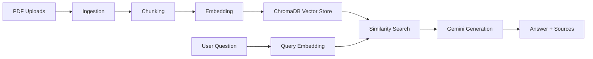

# Domain-Specific RAG Chatbot

## Project overview
This project is a portfolio-ready Retrieval-Augmented Generation (RAG) chatbot built in Python. It lets a user upload PDF documents, split them into meaningful chunks, store those chunks in a local vector database, and ask questions grounded in the uploaded content.

The design is intentionally educational: each step of the RAG pipeline is separated into its own module so it is easy to understand how retrieval and generation work together.

## Architecture


## Setup instructions
1. Create and activate a Python 3.11+ environment.
2. Install the dependencies:
   ```bash
   pip install -r requirements.txt
   ```
3. Copy the example environment file and add your Gemini API key:
   ```bash
   copy .env.example .env
   ```
4. Run the app:
   ```bash
   streamlit run app.py
   ```

## How RAG works here
1. Chunking: uploaded PDFs are split into smaller text chunks with overlap so the system can retrieve focused context rather than a whole document at once.
2. Embedding: each chunk is converted into a numerical vector using a local sentence-transformer model.
3. Retrieval: when the user asks a question, that question is embedded too and compared against stored chunks in ChromaDB to find the most relevant pieces.
4. Generation: the retrieved chunks are passed to Gemini as context, and the model is instructed to answer only from that information.

## Notes
- The vector store is stored locally in the chroma_db folder.
- Uploaded PDFs are saved in the data/uploads folder.
- The app uses a local embedding model, so it can run without paying for API-based embeddings.
